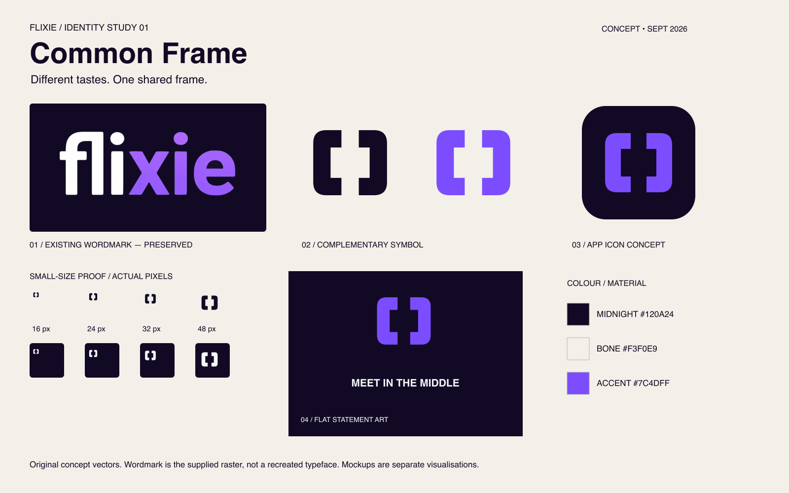
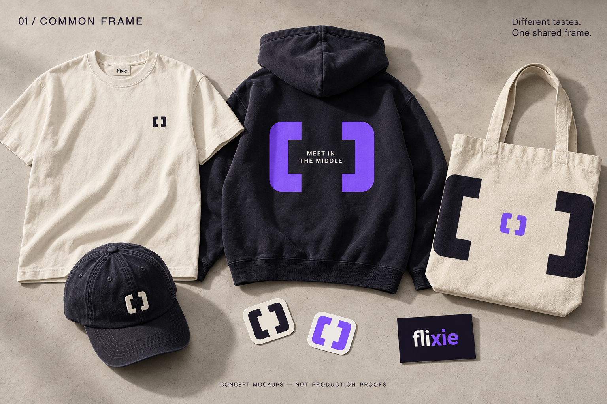
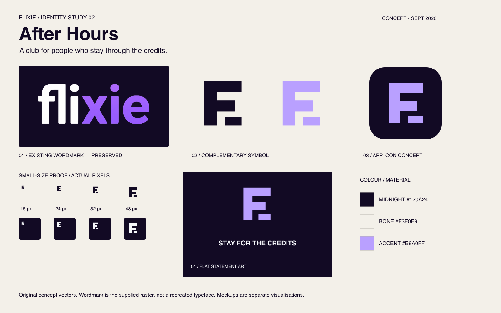
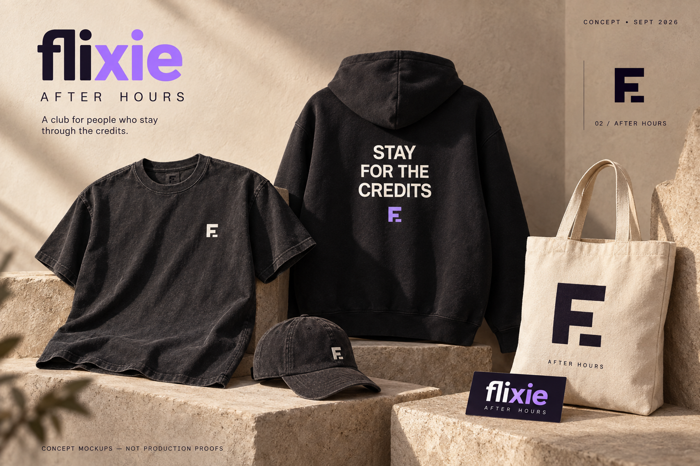
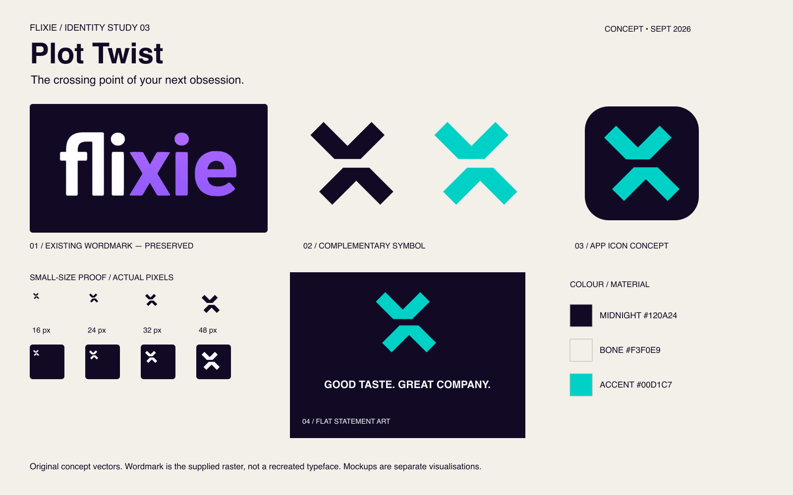
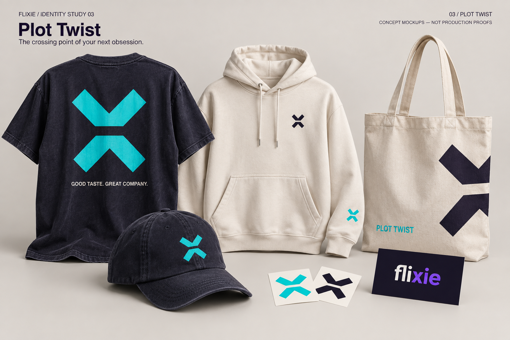

# Flixie — identity & merchandise studies

18 September 2026 · Round 1 · Concept development, not manufacturing release

## Recommendation

**Develop After Hours first.** It best answers the requested premium cinema-club / fashion-led positioning. Keep the existing Flixie wordmark as the primary identifier. Use the F monogram as a secondary shorthand, supported initially by the wordmark on labels, packaging and app onboarding. The graphic language is restrained enough to wear without feeling like an app advertisement; the credits slogan adds the cinema connection the monogram alone cannot carry.

This is a direction recommendation, not approval to replace the live app icon. No application code or current brand assets have been changed.

## Starting point

The supplied project contains `assets/icon/flixie_text_1024.png` and `assets/icon/flixie_icon_1024.png`. The first is preserved as a raster in the flat boards, with its existing shapes, colour and letter relationships. It has not been traced, retyped or presented as vector artwork. The second combines F and a play triangle; understandable, but a familiar category device. The app's theme uses purple #7C4DFF, midnight #120A24, cyan #00D1C7 and lilac #B9A0FF. Existing group recap imagery supports a social viewing and discussion proposition.

The original editable wordmark (SVG, AI or vector PDF) is needed before creating final one-colour wordmark separations or embroidery masters. A tiny fine edge from its original icon container may be visible in the supplied raster. Do not reproduce that edge in manufacturing artwork.

## 01 / Common Frame

Two opposing rounded brackets leave a shared space between them: different tastes arriving at one choice. The rounded outside corners complement the existing wordmark; the internal space can frame copy, a date or a club edition. The primary wordmark stays intact and separate.

- Everyday: bone tee with 32 mm midnight symbol; dark cap with 28 mm bone embroidery.
- Statement: midnight hoodie with a 272 mm violet frame and bone “MEET IN THE MIDDLE” inside it.
- Tote: expand the brackets into a composition around the centre of the bag, rather than repeat the chest lockup.
- Stickers: paired symbol, 50 mm visible artwork; die-cut border added by the supplier.
- App: one solid violet symbol on midnight, no slogan or wordmark squeezed into the tile.

**What works:** strong one-colour structure, straightforward printing, a social idea that extends into framing layouts. **What does not yet work:** brackets can imply code, scanning or focus controls. The social story must be built through repeated use; the shape alone does not say entertainment.

## 02 / After Hours

A compact F with a detached final bar treats the initial like a title card followed by an end mark. Its horizontal rhythm becomes a visual language for stacked credits and discreet club details. Lilac connects to the existing purple family without making every garment bright purple. “STAY FOR THE CREDITS” supplies a knowing cinema reference in original typography.

- Everyday: washed charcoal tee, bone F 32 mm wide at the left chest.
- Hoodie: three lines of bone credit-style type on the back, with a small lilac monogram below. Leave the front quiet.
- Cap: 28 mm bone monogram on a single front panel, offset from the centre seam.
- Tote: large midnight F with small AFTER HOURS caption; one-colour natural canvas option.
- Sticker: midnight rectangular club label using the exact primary wordmark once the vector master is available; the supplied editable symbol sticker is an alternative.
- App: lilac monogram on midnight. The detached bar is part of the mark, not a notification dot.

**What works:** the most wearable collection, a clear initial, low-detail embroidery and strong continuity with the current F icon. **What does not yet work:** an F alone is not inherently ownable, and the detached bar can look like punctuation. Keep it paired with the wordmark during introduction; test unaided recognition before making it the only public identifier. The square geometry is deliberately quieter than the rounded wordmark, but should not become a second primary logo.

## 03 / Plot Twist

An x-inspired mark split across an offset edit: two tastes, one unexpected match. This is a new geometric companion inspired by the wordmark's x, not an extraction or alteration of its lettering. Cyan comes from the existing app palette. The split can become a seam, a break in a print or an editorial divider.

- Statement tee: 280 mm cyan symbol with a deliberate central interruption and small bone “GOOD TASTE. GREAT COMPANY.” below.
- Everyday hoodie: small midnight chest symbol on bone; optional cyan sleeve detail is a second decoration location.
- Cap: 28 mm cyan embroidery, keeping the central gap open.
- Tote: an enlarged side-cropped symbol, subject to a separate seam-aware print layout; the included flat tote file is a simpler centred alternative.
- Stickers: cyan and midnight symbols as separate colourways, not a multicolour gradient.
- App: cyan symbol on midnight; no offset motion or colour effect is required for recognition.

**What works:** the strongest expressive graphic and closest conceptual tie to a distinctive letter in the wordmark. **What does not yet work:** the split x can read as opposing arrows, sport or gaming. It is a less natural fit for the premium cinema-club preference. The centre interruption needs more care at tiny sizes and in embroidery.

## Colour specifications

| Colour | sRGB / HEX | RGB | Approximate CMYK starting point |
|---|---|---|---|
| Midnight | #120A24 | 18, 10, 36 | 50, 72, 0, 86 |
| Bone | #F3F0E9 | 243, 240, 233 | 0, 1, 4, 5 |
| Violet | #7C4DFF | 124, 77, 255 | 51, 70, 0, 0 |
| Lilac | #B9A0FF | 185, 160, 255 | 27, 37, 0, 0 |
| Cyan | #00D1C7 | 0, 209, 199 | 100, 0, 5, 18 |

CMYK values above are mathematical approximations, not ICC-profiled conversions or textile recipes. Screen printing should use physical spot-ink drawdowns on the chosen fabric. Match embroidery thread from a real thread card. A Pantone reference should be selected against those samples; no unverified Pantone equivalence is supplied. Bone garment colour is a substrate choice and does not require a bone ink where bare fabric can provide it.

## Placement & production brief

These are starting dimensions for adult medium blanks. Measure from the garment's collar seam, not the hanger; approve grading and placement on the selected blank before a run.

| Product | Artwork size & placement | Method | Relative decoration cost |
|---|---|---|---|
| Everyday T-shirt | Symbol 32 mm visible width; centre approximately 90 mm toward wearer's left from centre front, 90–110 mm below collar seam | One-colour screen print; optional embroidery on a suitable stable blank | Low for one print location |
| Statement tee | Up to 280 × 320 mm artboard; centred back; top 90 mm below rear collar | One or two spot colours | Medium; dark blank may need underbase |
| Hoodie | Up to 280 × 320 mm; top approximately 140 mm below rear collar, adjusted so hood does not cover key copy | One/two colours; avoid pocket seams and zip | Medium; sleeve decoration adds another setup |
| Cap | Symbol 28 mm visible width; After Hours height about 33 mm; centre on one front panel, lower edge at least 18 mm above brim seam | Flat embroidery, one thread colour | Medium setup; reusable digitisation |
| Tote | Flat master 220 × 260 mm; visible symbol 180 mm wide; top 65–80 mm below upper edge, centred between handle attachments | One-colour screen print | Low; a seam-cropped print can require a cut-panel process and cost more |
| Sticker | Symbol 50 mm visible width plus 2–3 mm border; add supplier bleed and cut path | Opaque vinyl, matte finish | Low per unit at volume; custom cutting/setup applies |

Initial construction assumptions: relaxed 220–260 gsm cotton tee, 350–420 gsm hoodie, unstructured cotton twill cap, sturdy canvas tote. These are design targets, not supplier recommendations or price quotes.

Keep positive printed strokes at least 0.5 mm and negative gaps at least 0.7 mm as conservative initial artwork targets. For embroidery aim for strokes and gaps at least 1.2–1.5 mm and lettering at least 5–6 mm high; the actual minimum depends on thread, fabric and digitiser. The small monograms intentionally omit text. Approve a sew-out at actual size. Avoid tiny registered marks, fine distressing, gradients and simulated texture in the physical artwork.

Dark blanks can need an additional white underbase screen even when two visible colours are specified. The existing raster wordmark has tonal variation: do not treat it as a ready two-spot-colour separation. Choose a flat-colour version only after receiving the original master and approving its conversion. Lowest-complexity first drop: one blank colour, one decoration location, one colour/thread per item. Stock breadth, garment quality, quantities and number of locations usually matter more than the simplicity of the symbol alone. Obtain quotations at the same quantity and blank specification before comparing suppliers.

## Small-size check

Each flat board includes 16, 24, 32 and 48 px symbol boxes on bone and midnight. Those dimensions are the symbol's 100-unit canvas scaled to the listed size, so the visible ink is smaller than the box. Inspect the 1600 px PNG at 100% to judge the samples; a scaled document preview is not a native-size test.

Common Frame retains its opening but can read as brackets. After Hours retains the F; its detached bar is the first detail to weaken at 16 px. Plot Twist retains the two pieces but its offset becomes subtle at 16 px. Use the main silhouettes at 24 px and above in initial application; the 16 px studies are stress tests, not evidence from a recognition study. One-colour midnight-on-bone and white-on-midnight versions remove dependence on accent colour. App icon SVGs have opaque full-square backgrounds; rounded corners on the boards simulate an OS mask. Final platform safe zones, adaptive masks and actual device screenshots remain part of implementation, not this concept round.

## Files and status

Every direction contains:

- `flat-board.svg` and `.png`: concept presentation; SVG embeds the original raster wordmark.
- `symbol.svg`, `symbol-reversed.svg`: editable original path artwork with transparent background.
- `app-icon.svg`: editable full-square concept, not a complete iOS/Android export set.
- `statement-art.svg`: generic direction study, not every garment's exact layout.
- `tee-chest-32mm.svg`, `cap-28mm.svg`, `statement-back-layout.svg`, `tote-layout.svg`, `sticker-symbol-50mm.svg`: editable physical-dimension concept masters. The plot-twist back layout is for the statement tee, not its understated hoodie. Text remains live Helvetica/Arial for editability; final font choice and outlined copies are still required.
- `mockup.png`: AI-generated visualisation. Fabric, scale, colours, stitch detail and lettering are illustrative. In particular, the generated wordmarks are approximations; the After Hours scene also recolours the large wordmark for its light background. Neither is an authorised replacement for the supplied logo. The Plot Twist mockup is more symmetrical than its offset vector master. The flat vectors control the geometry; any discrepancy in the mockup is not an approved logo change.

All new symbols are original geometric constructions. No film characters, posters or other brands' marks were used. These are not trademark clearance results. No files are labelled production-ready: selection, original wordmark master, final copy/font outlines, spot separations, garment-specific placement approval, embroidery digitisation, sticker cut lines and physical sample approval remain before release.

Generated merchandise scenes use the built-in image-generation tool. Exact prompts are saved in `generation-prompts.json`; each corresponding flat board was supplied as its visual reference.

## Suggested refinement

Select After Hours as the main route, then refine the F's detached bar and corner character against the original rounded wordmark. Start with the small chest tee, one-panel embroidered cap and credits hoodie. Treat the tote and sticker as supporting club pieces. Compare a bone-on-charcoal sample with lilac-on-midnight before selecting the final thread and ink. Keep the original wordmark the most prominent name on packaging and digital brand introductions.
